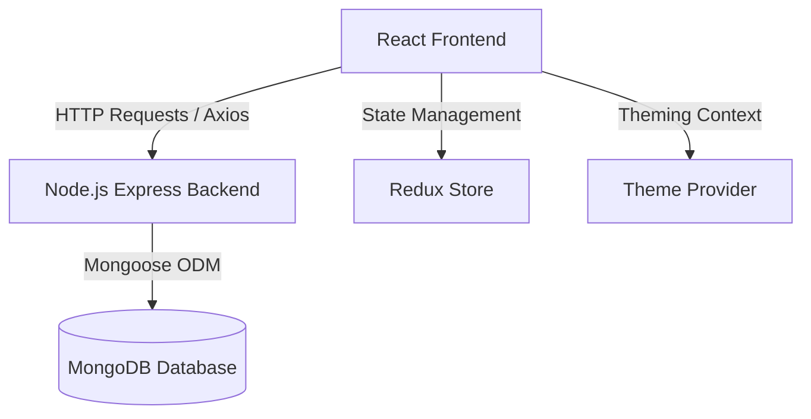

# EMMARKET Project Summary

This project is a **Point of Sale (POS) & Inventory Management System** (named **EMMARKET**) designed for supermarkets to manage inventories, customer carts, and checkout processes. The project is split into a **Frontend Client** and a **Backend Server**.

---

## 1. High-Level Architecture

The system utilizes a client-server architecture with a React-based frontend communicating via REST APIs with a Node.js Express backend, backed by MongoDB.

---

## 2. Technology Stack

### Frontend (`POS-System-dev`)
- **Core Framework**: React (v18.2) & TypeScript.
- **State Management**: Redux for global application states (carts, products, categories, unit of measures), combined with React Contexts for UI states (Theme, Snackbar).
- **Routing**: React Router DOM (v6) with custom Route Guards (`Guard`, `AuthenticationGuard`).
- **Form Management**: Formik & Yup for form validation.
- **Styling**: Vanilla CSS Modules with a custom dynamic theme provider (supporting Dark, White, Material, and Green themes).
- **Icons**: FontAwesome SVG Core.
- **Development & Testing**: Storybook for UI component isolation and testing.
- **Key Installed Packages**: `react-to-print`, `jspdf`.

### Backend (`POS-Backend-main`)
- **Runtime Environment**: Node.js.
- **Web Framework**: Express.js.
- **Database**: MongoDB with Mongoose ODM.
- **Authentication**: JWT (JSON Web Tokens) & `bcryptjs` for password hashing.
- **Media Uploads**: Multer middleware for storing product images.
- **Process Manager**: Nodemon for local hot-reloading development.
- **Key Installed Packages**: `pdfkit`, `uuid`.

---

## 3. Database Schema

The backend defines eleven main Mongoose models:

| Model | Fields | References / Types |
|---|---|---|
| **`User`** | `username` (Unique string), `password` (Hashed string), `admin` (Boolean) | - |
| **`Product`** | `productName` (String), `productCategory` (ObjectId), `unitOfMeasure` (ObjectId), `productImage` (String path), `productPrice` (Number), `stockQuantity` (Number), `reorderLevel` (Number), `expiryDate` (Date), `batchNumber` (String), `supplierReference` (ObjectId) | `Category`, `UnitOfMeasure`, `Supplier` |
| **`Cart`** | `description` (String), `tax` (Number), `discount` (Number), `products` (Array of items) | `Product`, `qty` (Number) |
| **`Category`** | `categoryName` (Unique string) | - |
| **`UnitOfMeasure`** | `unitOfMeasureName` (Unique string), `baseUnitOfMeasure` (String), `conversionFactor` (Number) | - |
| **`Invoice`** | `invoiceNumber` (Unique string), `cart` (ObjectId), `cashier` (String), `amountPaid` (Number), `changeGiven` (Number), `paymentMethod` (String), `timestamp` (Date), `pdfPath` (String) | `Cart` |
| **`Transaction`** | `transactionNumber` (Unique string), `invoice` (ObjectId), `cashier` (String), `paymentMethod` (String), `totalAmount` (Number), `type` (String enum: "sale"/"refund"/"void"), `timestamp` (Date) | `Invoice` |
| **`Refund`** | `refundNumber` (Unique string), `originalInvoice` (ObjectId), `refundedItems` (Array of refunded products, quantities, and price), `totalRefundedAmount` (Number), `reason` (String), `cashier` (String), `timestamp` (Date) | `Invoice`, `Product` |
| **`Supplier`** | `supplierName` (Unique string), `contactName` (String), `email` (String), `phone` (String), `address` (String) | - |
| **`Batch`** | `batchNumber` (Unique string), `expiryDate` (Date), `receivedDate` (Date) | - |
| **`PurchaseOrder`** | `poNumber` (Unique string), `supplier` (ObjectId), `items` (Array of products, quantities, and unit price), `status` (String enum: "Draft"/"Ordered"/"Received"/"Cancelled"), `totalAmount` (Number), `timestamp` (Date) | `Supplier`, `Product` |
| **`InventoryMovement`** | `product` (ObjectId), `qty` (Number), `type` (String enum: "restock"/"sale"/"refund"/"adjustment"/"expiry_void"), `reason` (String), `timestamp` (Date) | `Product` |

---

## 4. Key System Features

### Cashier / POS Operations
- **Multi-Cart Support**: The system allows concurrent management of multiple customer carts.
- **Calculations**: Accurate real-time calculation of order totals, custom discounts, and taxes.
- **Product Filter & Search**: Cashiers can browse products by category, unit of measure, or search by name.
- **Display Modes**: Toggleable layout structures between grid/card views and detailed lists.
- **Thermal Invoice Printing**: Formatted printable thermal receipts (80mm) showing items, subtotals, tax/discount details, cashier logs, and change calculations. Supports direct physical printing or custom PDF downloads.
- **Reprint Last Receipt**: Easy click feature to instantly reprint the receipt for the last completed checkout transaction.

### Sales History & Analytics
- **Dashboard & Logs**: Detailed list page displaying completed sales transactions and partial/full refunds.
- **Aggregations & Analytics**: Visual summary counters for Net Sales, Gross Sales, and Total Money Refunded.
- **Granular Search Filters**: Allows filtering transaction logs by Cashier name, Payment Method (Cash, Card, Mobile, Credit), Date range, and transaction types.
- **Refund Processing System**: Cashiers can selectively adjust item return quantities to process full or partial transaction refunds, automatically creating matching "refund" logs and calculating proportional tax/discount offsets.
- **CSV Data Exporting**: Support for exporting matching transaction logs to downloadable spreadsheet-friendly CSV files.
- **Mutation Audit Logs**: Express security middleware capturing every mutation endpoint payload (POST, PUT, DELETE, PATCH) into a logged `logs/audit.log` file on the server.

### Stock & Restocking Management
- **Inventory Ledger**: Complete stock level directory displaying product names, category, units, available stock quantity, custom reorder levels, and expiration alerts.
- **Overselling Prevention**: Checkout validation that checks current stock quantity before saving checkouts, rejecting transactions with a 400 error if stock levels are insufficient.
- **Automated Stock Deductions**: Real-time stock reduction and logged `InventoryMovement` of type "sale" upon checkout completion.
- **Restocking Workflow**: Integrated Purchase Order system enabling managers to compile restocking draft requests from registered suppliers, update dispatch status, and automatically increment product stock levels and save `InventoryMovement` restock logs when PO is transitioned to "Received".
- **Supplier CRUD Directory**: Complete supplier record tracker supporting name, email, phone, and physical address parameters.
- **Manual Stock Adjustments**: Managers can adjust product quantities up/down (correcting audit spillage/leakages) which updates database counts and registers matching `InventoryMovement` adjustments.
- **Stock Restoration on Refund**: Automatically returns returned refund quantities to physical stock levels and saves movement logs.

### Inventory & Resource Management
- **Products**: CRUD capability for adding new items, configuring pricing, referencing specific units of measure, categories, and uploading images.
- **Categories**: Simple dashboard to add, edit, and delete inventory categories.
- **Units of Measure**: Custom unit configurations with conversion factors (e.g., base unit to pack/kg).

### User Authentication & Settings
- **Auth Guard**: Full page-level access protection. Non-authenticated users are forced to `/auth` login.
- **Dashboard & Roles**: Admin users have specific system privileges (e.g., user administration). 
- **Theme Selection**: Dynamic user experience with 4 switchable UI styles (Dark, White, Material, Green) persisted across sessions.
