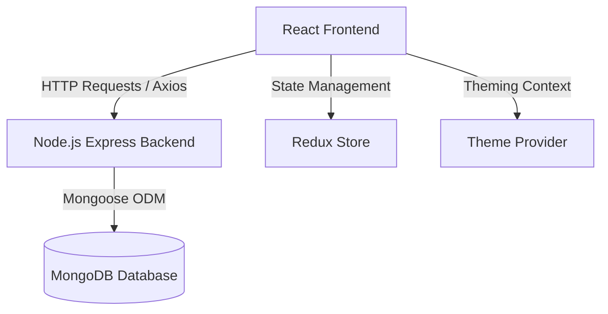

# EMMARKET Project Summary

This project is a **Point of Sale (POS) & Inventory Management System** (named **EMMARKET**) designed for supermarkets to manage inventories, customer carts, and checkout processes. The project is split into a **Frontend Client** and a **Backend Server**.

---

## 1. High-Level Architecture

The system utilizes a client-server architecture with a React-based frontend communicating via REST APIs with a Node.js Express backend, backed by MongoDB.

---

## 2. Technology Stack

### Frontend (`POS-System-dev`)
- **Core Framework**: React (v18.2) & TypeScript.
- **State Management**: Redux for global application states (carts, products, categories, unit of measures), combined with React Contexts for UI states (Theme, Snackbar).
- **Routing**: React Router DOM (v6) with custom Route Guards (`Guard`, `AuthenticationGuard`).
- **Form Management**: Formik & Yup for form validation.
- **Styling**: Vanilla CSS Modules with a custom dynamic theme provider (supporting Dark, White, Material, and Green themes).
- **Icons**: FontAwesome SVG Core.
- **Development & Testing**: Storybook for UI component isolation and testing.

### Backend (`POS-Backend-main`)
- **Runtime Environment**: Node.js.
- **Web Framework**: Express.js.
- **Database**: MongoDB with Mongoose ODM.
- **Authentication**: JWT (JSON Web Tokens) & `bcryptjs` for password hashing.
- **Media Uploads**: Multer middleware for storing product images.
- **Process Manager**: Nodemon for local hot-reloading development.

---

## 3. Database Schema

The backend defines five main Mongoose models:

| Model | Fields | References / Types |
|---|---|---|
| **`User`** | `username` (Unique string), `password` (Hashed string), `admin` (Boolean) | - |
| **`Product`** | `productName` (String), `productCategory` (ObjectId), `unitOfMeasure` (ObjectId), `productImage` (String path), `productPrice` (Number) | `Category`, `UnitOfMeasure` |
| **`Cart`** | `description` (String), `tax` (Number), `discount` (Number), `products` (Array of items) | `Product`, `qty` (Number) |
| **`Category`** | `categoryName` (Unique string) | - |
| **`UnitOfMeasure`** | `unitOfMeasureName` (Unique string), `baseUnitOfMeasure` (String), `conversionFactor` (Number) | - |

---

## 4. Key System Features

### Cashier / POS Operations
- **Multi-Cart Support**: The system allows concurrent management of multiple customer carts.
- **Calculations**: Accurate real-time calculation of order totals, custom discounts, and taxes.
- **Product Filter & Search**: Cashiers can browse products by category, unit of measure, or search by name.
- **Display Modes**: Toggleable layout structures between grid/card views and detailed lists.

### Inventory & Resource Management
- **Products**: CRUD capability for adding new items, configuring pricing, referencing specific units of measure, categories, and uploading images.
- **Categories**: Simple dashboard to add, edit, and delete inventory categories.
- **Units of Measure**: Custom unit configurations with conversion factors (e.g., base unit to pack/kg).

### User Authentication & Settings
- **Auth Guard**: Full page-level access protection. Non-authenticated users are forced to `/auth` login.
- **Dashboard & Roles**: Admin users have specific system privileges (e.g., user administration). 
- **Theme Selection**: Dynamic user experience with 4 switchable UI styles (Dark, White, Material, Green) persisted across sessions.
